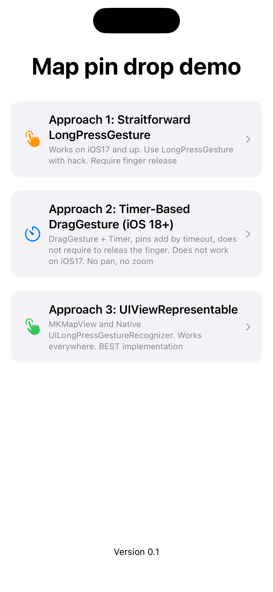
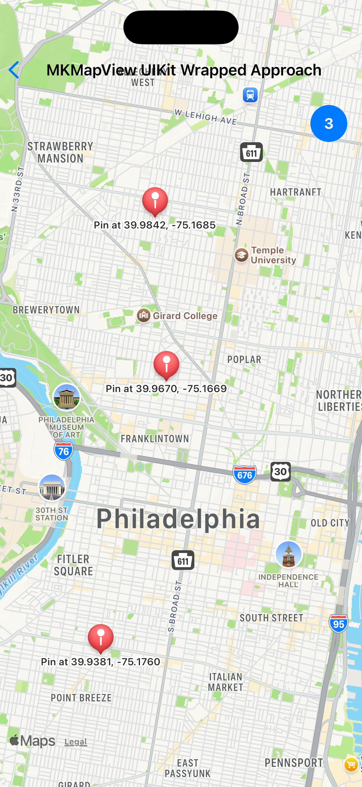
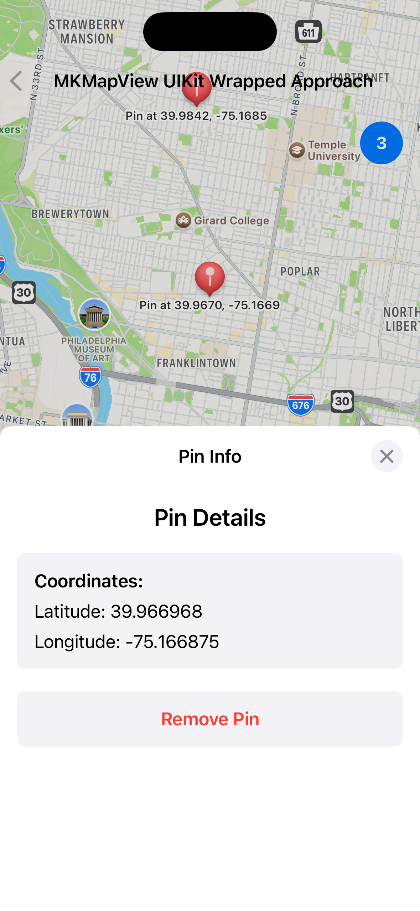
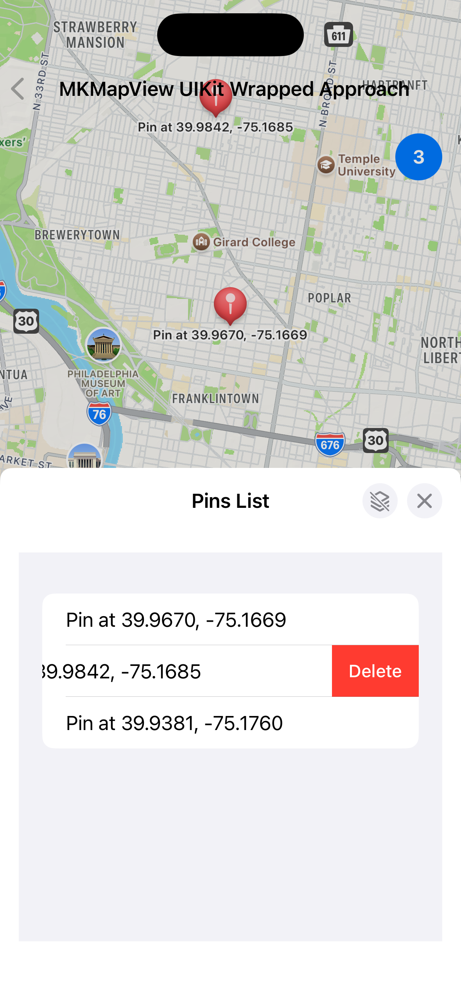

# Map pin drop demo
## SwiftUI MapKit and UIKit Wrapped Map

Drop pin with long press. Three implementation to compare. 

## Approach 1: Straitforward LongPressGesture
- Works on iOS17 and up
- Uses LongPressGesture with hack
- Require finger release

## Approach 2: Timer-Based DragGesture (iOS 18+)
- DragGesture + Timer
- pin adds by timeout (does not require finger release)
- Does not work on iOS17. No pan, no zoom!

## Approach 3: UIViewRepresentable
- MKMapView and Native UILongPressGestureRecognizer
- Works everywhere.
- BEST implementation
- Require extra code  

## Screensots

  
  
  
  

## Screensots

